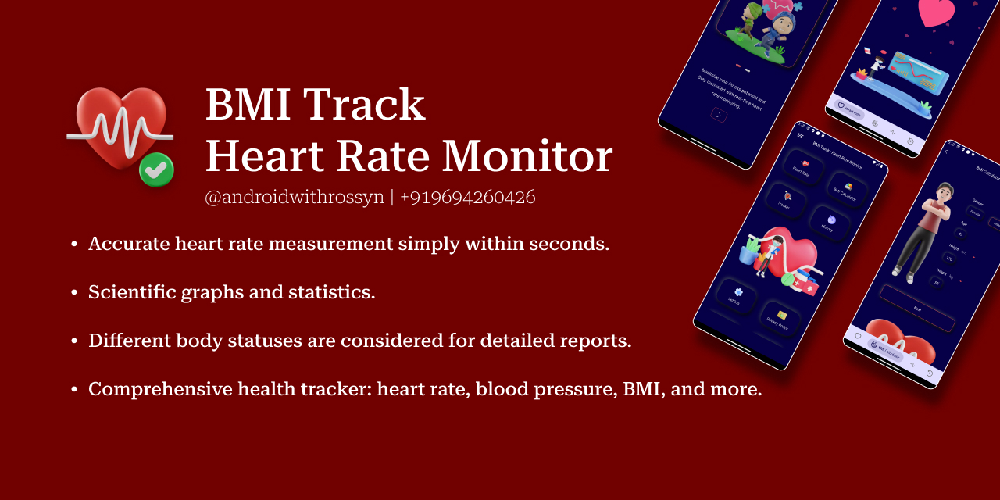

<h2 align="center">BMI Track Heart Rate Monitor</h2>


<p align="center">
    <a href="">
      
    </a>
  </p>


**BMITrackHeartRateMonitor** is a comprehensive health app designed to track your Body Mass Index (BMI) and monitor your heart rate in real-time. It offers personalized insights and helps you maintain a balanced lifestyle by keeping tabs on your vital health metrics. Whether you're aiming to achieve fitness goals or simply stay informed about your health, BMITrackHeartRateMonitor provides an easy-to-use interface and accurate data to support your wellness journey.

### Key features you can enjoy
- Accurate heart rate measurement simply within seconds.
- Scientific graphs and statistics.
- Different body statuses are considered for detailed reports.
- Comprehensive health tracker: heart rate, blood pressure,  BMI, and more.
- Get target heart rate and maximum zone for training.
- Easy sharing and printing health reports.


## Screenshots:

 <p align="center">
    <a>
      
    </a>
 <a>
      
    </a>
  <a>
      
    </a>
     <a>
      
    </a>
<a>
    
    </a>
 <a>
      
    </a>
 <a>
    
    </a>
 <a>
      
    </a>
 <a>
  </p>


### Find this Repository useful? ❤️
Support it by joining stargazers for this repository. ⭐

Also, [follow me on GitHub](https://github.com/AndroidWithRossyn/) for my next creations! 🤩

### Contributors ✨

Thanks goes to these wonderful people :

<table>
  <tr>
    <td align="center"><a href="https://github.com/AndroidWithRossyn/"><br /><sub><b>AndroidWithRossyn</b></sub></a><br /></td>
    <td align="center"><a href="https://github.com/CodersSmile"><br /><sub><b>CodersSmile</b></sub></a><br /></td>
    <td align="center"><a href="https://github.com/Priya122002"><br /><sub><b>Priya122002</b></sub></a><br /></td>
  </tr>
</table>


### License
```
Copyright 2023 CodersSmile (Priya122002)

Licensed under the Apache License, Version 2.0 (the "License");
you may not use this file except in compliance with the License.
You may obtain a copy of the License at

   http://www.apache.org/licenses/LICENSE-2.0

Unless required by applicable law or agreed to in writing, software
distributed under the License is distributed on an "AS IS" BASIS,
WITHOUT WARRANTIES OR CONDITIONS OF ANY KIND, either express or implied.
See the License for the specific language governing permissions and
limitations under the License.
```

<p align="center">
  
</p>
